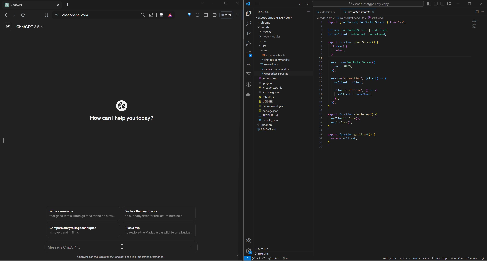

VSCode Chatgpt Easy Copy is a simple utility to make it slightly convenient to copy code/text and files from vscode into chatgpt's textarea using [commands](https://code.visualstudio.com/docs/getstarted/userinterface#_command-palette) which can be assigned a keyboard shortcut.

There are two components at play here: a [chrome extension](https://github.com/nikhils98/vscode-chatgpt-easy-copy/tree/main/chrome) and [vscode extension](https://github.com/nikhils98/vscode-chatgpt-easy-copy/tree/main/vscode). A short summary of how it works is that the vscode extension starts a websocket server which the chrome extension connects to. On execution of a command, the selected text or contents of file(s) are sent to the chrome extension via websocket which manipulates chatgpt's DOM to input in the prompt textarea and send. More details can be found in the respective README's of the extensions. Installation instructions are below

# Setup

## VSCode Extension

### Visual Studio Marketplace

https://marketplace.visualstudio.com/items?itemName=longhairprogrammer.vscode-chatgpt-easy-copy

### Manual

#### Download

Download the latest version of the package (.vsix) file from Releases.

#### Installation

There are two ways to install the .vsix file:

From Extensions view

1. Click Views and More Actions (3 dots on top right of the view)
2. Select Install from VSIX

OR

Run the following command in terminal

```
code --install-extension vscode-chatgpt-easy-copy-0.0.1.vsix
```

## Chrome Extension

Ideally it should work in any Chromium based browser. It's been tested in Brave and Chrome.

### Chrome Web Store

https://chromewebstore.google.com/detail/vscode-chatgpt-easy-copy/npfadfmeapkbafndfhaodpehcibibijg

### Manual

1. Download the latest stable source code zip from Releases and unzip it.
2. Go to the Extensions page in your browser and enable Developer mode.
3. Click the Load Unpacked button and select the **chrome** directory from the unzipped folder.
4. Activate the extension if not active by default. Thats it!

For more information check chrome's docs on [loading unpacked extensions](https://developer.chrome.com/docs/extensions/get-started/tutorial/hello-world#load-unpacked).

# Demo

## Copy Text



## Copy File


# Privacy Policy

No user data is collected in either of the extensions
