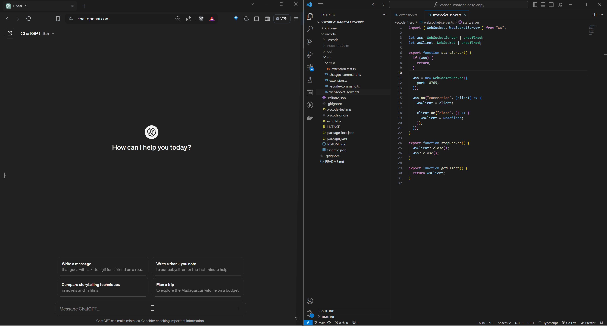

A simple utility to make it slightly convenient to copy code/text and files from vscode into chatgpt's textarea using [commands](https://code.visualstudio.com/docs/getstarted/userinterface#_command-palette) which can be assigned a keyboard shortcut.

There are two components at play here: a [chrome extension](https://github.com/nikhils98/vscode-chatgpt-easy-copy/tree/main/chrome) and [vscode extension](https://github.com/nikhils98/vscode-chatgpt-easy-copy/tree/main/vscode). A short summary of how it works is that the vscode extension starts a websocket server which the chrome extension connects to. On execution of a command, the selected text or contents of file(s) are sent to the chrome extension via websocket which manipulates chatgpt's DOM to input in the prompt textarea and send. More details and installation instructions can be found in the respective README's of the extensions.

## Demo

### Copy Text

### Copy File

