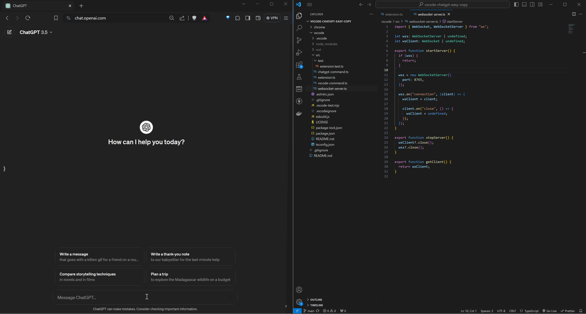

# Setup

## Visual Studio Marketplace

TBA

## Manual

### Download

Download the latest version of the package (.vsix) file from Releases.

### Installation

There are two ways to install the .vsix file

From Extensions view

1. Click Views and More Actions (3 dots on top right of the view)
2. Select Install from VSIX

OR

Run the following command in terminal

```
code --install-extension vscode-chatgpt-easy-copy-0.0.1.vsix
```

# How it works

This extension starts a websocket server at port 8765 on vscode startup and uses it to exchange commands with the chrome extension

## Commands

Commands can be run from the command palette or context menu (in the case of Copy File) and assigned a keyboard shortcut from Preferences.

Note all commands **append** to the content in the prompt textbox.

### Copy text

Copies the selected text in chatgpt. You can modify it before sending the message

### Copy text and send

Copies the selected text and triggers the send button in chatgpt



### Copy file

Copies the content of the selected file(s). Simply select a file or multiple files in the explorer and right click or open command palette. Choose one of `Copy file` or `Copy file and send` on which the file paths and their contents will be copied over to chatgpt textbox.

If you select a directory then all the files inside will be recursively copied over.

### Copy file and send

Same as `Copy file` but it also triggers send button right away.


